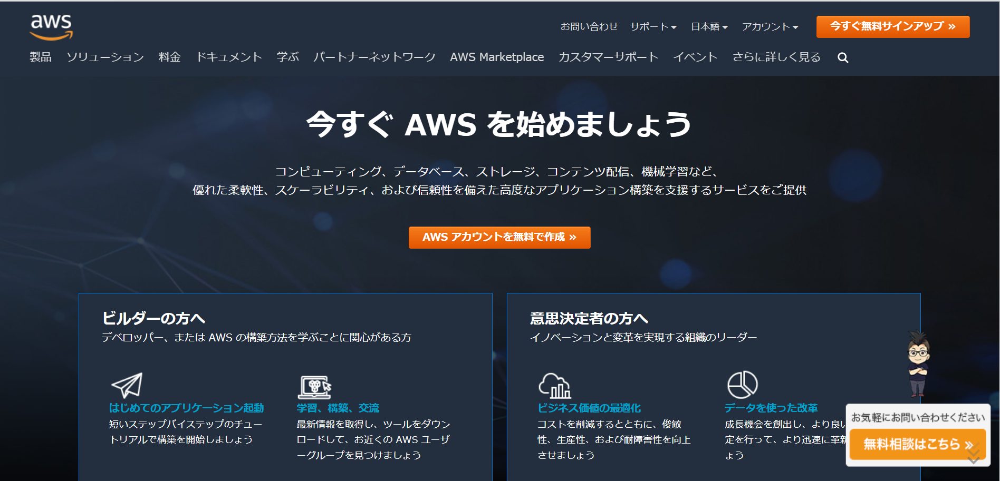

# AWS とは

## AWS とは

<figure markdown>

<figcaption>https://aws.amazon.com/jp/</figcaption>
</figure>

> AWS には、コンピューティング、ストレージ、データベースなどのインフラストラクチャテクノロジーから機械学習、AI、データレイクと分析、IoT などの最新鋭のテクノロジーに至るまで、他のどのクラウドプロバイダーよりもはるかに多くのサービスを提供しており、それぞれのサービスが豊富な機能を備えています。より速く、より簡単に、より高い費用対効果で既存のアプリケーションをクラウドに移行し、想像できるものはほぼすべて構築することが可能です。
> AWS サービスは最も充実した機能を提供します。例えば、AWS はさまざまな種類のアプリケーション専用に設計された幅広いデータベースを提供しているため、ジョブに最適なツールを選択して、最高のコストとパフォーマンスを実現できます。
> [https://aws.amazon.com/jp/what-is-aws/?nc1=f_cc](https://aws.amazon.com/jp/what-is-aws/?nc1=f_cc)

## 様々な AWS のサービス

AWS には多くのサービスがあります。2022 年では**223 個**のサービスがあります。

!!! Info

    こちらの記事で各サービスの詳細が紹介されいます。
    【2022 年】AWS 全サービスまとめ
    https://dev.classmethod.jp/articles/aws-summary-2022/

<iframe style="width: 100%; aspect-ratio: 16 / 9;" src="https://www.youtube.com/embed/LgNbu_joVhc?start=909" title="YouTube video player" frameborder="0" allow="accelerometer; autoplay; clipboard-write; encrypted-media; gyroscope; picture-in-picture" allowfullscreen></iframe>

!!! note

    今回の演習で使用する EC2 を解説している時間から再生されます。

(コラム)AWSが使われているところ

<a href="https://speakerdeck.com/isoparametric/grand-orderniokeru-deiraitowakusuliu-awsdao-ru-huo-yong-shu-cedec-2016bian">Fate/Grand Orderにおける、ディライトワークス流AWS導入＆活用術CEDEC 2016編</a>
 
様々な業界でAWSが使われています。WEBサービスはもちろん、ゲームの裏側を支えるシステムでAWSが使われています。

## EC2 のはじめ方(参考)

<iframe style="width: 100%; aspect-ratio: 16 / 9;" src="https://www.youtube.com/embed/xXWlSHuos-0" title="YouTube video player" frameborder="0" allow="accelerometer; autoplay; clipboard-write; encrypted-media; gyroscope; picture-in-picture" allowfullscreen></iframe>

!!! tip

    今回の演習で使用する EC2 のはじめ方を丁寧に解説しています。本演習では、一部設定を変更しますが、ほとんど同じなので参考にしてください。
