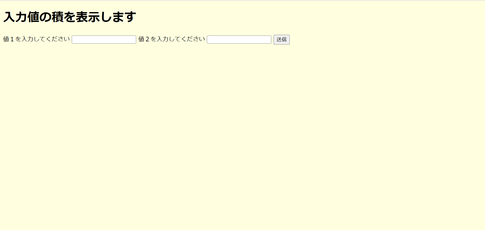
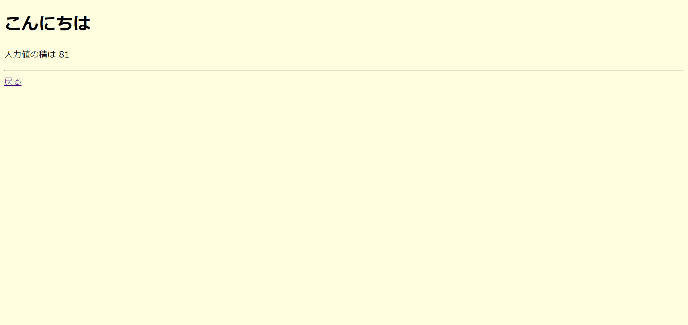

# Python(CGI)を動かす

## CGI とは

> CGI（Common Gateway Interface）は、クライアント側の Web ブラウザの要求に応じて Web サーバが外部プログラムを呼び出して、その実行結果が HTTP を介してクライアントの Web ブラウザに送信される仕組みのことです。
> Web サイトで例えば掲示板、アクセスカウンター、アンケートフォームなど Web ページの内容を動的に変化させたい時に CGI を使用します。CGI のプログラムは Perl（パール）と呼ばれるプログラミング言語などによって記述されています。

!!! note

    Perl以外ではPythonやRuby, C言語などでプログラムを実行することができる。

## Apache の設定

```sh
ubuntu@ip-172-31-85-199:/var/www/html$ sudo vim /etc/apache2/sites-enabled/000-default.conf
```

`/etc/apache2/sites-enabled/000-default.conf`を編集し、Python スクリプトを有効化します。

### 変更前

```conf
<VirtualHost *:80>
        # The ServerName directive sets the request scheme, hostname and port that
        # the server uses to identify itself. This is used when creating
        # redirection URLs. In the context of virtual hosts, the ServerName
        # specifies what hostname must appear in the request's Host: header to
        # match this virtual host. For the default virtual host (this file) this
        # value is not decisive as it is used as a last resort host regardless.
        # However, you must set it for any further virtual host explicitly.
        #ServerName www.example.com

        ServerAdmin webmaster@localhost
        DocumentRoot /var/www/html

        # Available loglevels: trace8, ..., trace1, debug, info, notice, warn,
        # error, crit, alert, emerg.
        # It is also possible to configure the loglevel for particular
        # modules, e.g.
        #LogLevel info ssl:warn

        ErrorLog ${APACHE_LOG_DIR}/error.log
        CustomLog ${APACHE_LOG_DIR}/access.log combined

        # For most configuration files from conf-available/, which are
        # enabled or disabled at a global level, it is possible to
        # include a line for only one particular virtual host. For example the
        # following line enables the CGI configuration for this host only
        # after it has been globally disabled with "a2disconf".
        # Include conf-available/serve-cgi-bin.conf
</VirtualHost>

# vim: syntax=apache ts=4 sw=4 sts=4 sr noet
```

### 変更後

```conf hl_lines="11 15 16 17 18"
<VirtualHost *:80>
        # The ServerName directive sets the request scheme, hostname and port that
        # the server uses to identify itself. This is used when creating
        # redirection URLs. In the context of virtual hosts, the ServerName
        # specifies what hostname must appear in the request's Host: header to
        # match this virtual host. For the default virtual host (this file) this
        # value is not decisive as it is used as a last resort host regardless.
        # However, you must set it for any further virtual host explicitly.
        #ServerName www.example.com

        AddHandler cgi-script .cgi .py
        ServerAdmin webmaster@localhost
        DocumentRoot /var/www/html

        <Directory /var/www/html>
                Options ExecCGI
                DirectoryIndex index.php
        </Directory>

        # Available loglevels: trace8, ..., trace1, debug, info, notice, warn,
        # error, crit, alert, emerg.
        # It is also possible to configure the loglevel for particular
        # modules, e.g.
        #LogLevel info ssl:warn

        ErrorLog ${APACHE_LOG_DIR}/error.log
        CustomLog ${APACHE_LOG_DIR}/access.log combined

        # For most configuration files from conf-available/, which are
        # enabled or disabled at a global level, it is possible to
        # include a line for only one particular virtual host. For example the
        # following line enables the CGI configuration for this host only
        # after it has been globally disabled with "a2disconf".
        # Include conf-available/serve-cgi-bin.conf
</VirtualHost>

# vim: syntax=apache ts=4 sw=4 sts=4 sr noet
```

`.cgi`, `.py`の拡張子のスクリプト(CGI)を実行可能にします。

```
AddHandler cgi-script .cgi .py
```

`Options ExecCGI`

`/var/www/html`の中の CGI ファイルを実行可能にします。

`DirectoryIndex index.php`

`index.php`を最初に表示されるファイルに設定します。(デフォルトでは`index.html`です。)

```
<Directory /var/www/html>
    Options ExecCGI
    DirectoryIndex index.php
</Directory>
```

### コード

```html title="/var/www/html/test.html"
<!DOCTYPE html>
<html>
  <head>
    <meta charset="utf-8" />
  </head>

  <body bgcolor="lightyellow">
    <h1>入力値の積を表示します</h1>
    <form action="index.py" method="POST">
      値１を入力してください
      <input type="text" name="value1" />
      値２を入力してください
      <input type="text" name="value2" />
      <input type="submit" name="submit" value="送信" />
    </form>
  </body>
</html>
```

```py title="/var/www/html/index.py"
#!/usr/bin/python3
# -*- coding: utf-8 -*-
import cgi
form = cgi.FieldStorage() # cgiオブジェクト作成
v1 = form.getfirst('value1') # nameがvalue1の値を取得
v2 = form.getfirst('value2') # nameがvalue2の値を取得
#入力値が数字ならその積を返す関数
def times(a, b):
    try:
        a=int(a)
        b=int(b)
        return str(a*b)
    except ValueError:
        return('数値じゃないので計算できません(>_<)')

# ブラウザに戻すHTMLのデータ
print("Content-Type: text/html")
print()
htmlText = '''
<!DOCTYPE html>
<html>
    <head><meta charset="utf-8" /></head>
<body bgcolor="lightyellow">
    <h1>こんにちは</h1>
    <p>入力値の積は %s<br/></p>
    <hr/>
    <a href="test.html">戻る</a>
</body>
</html>
'''%(times(v1,v2)) # 入力値の積を%sの箇所に埋める
```

!!! note

    `index.py`には権限の755などを指定してください。(その他のユーザーに、スクリプトの実行権限と読み取り権限を与えて下さい)
    詳細は以下を確認してください。
    [パーミッション](../security/permission.md)

## 結果

!!! note

    **SSH**接続した際に使った**IP アドレス**をブラウザに入力する。
    `http://{ip address}/test.html`にアクセスする。



入力してボタンを押した結果



このように入力した数字の積が出力されれば正常です。

## 参考

[Python で CGI を用いた Web アプリケーションを作る](https://qiita.com/TSKY/items/b041de0572e6586c889c)
