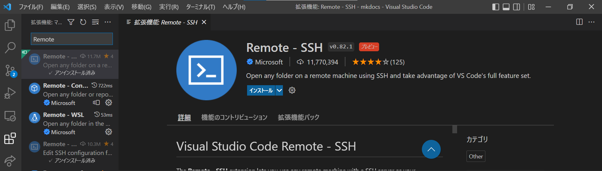
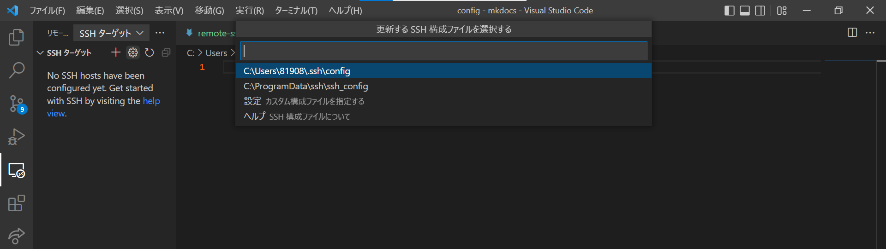
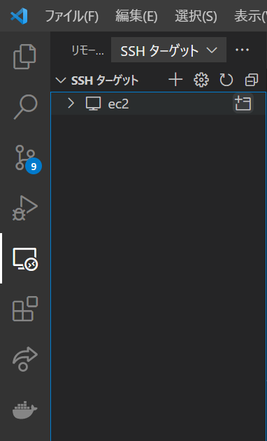
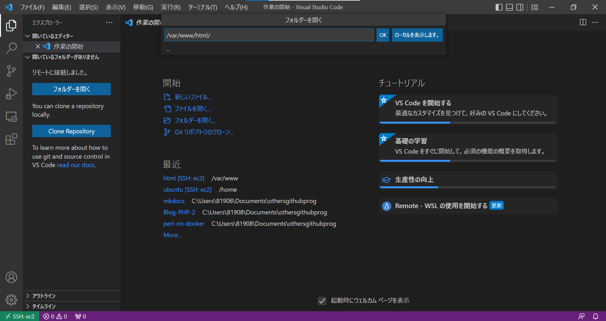
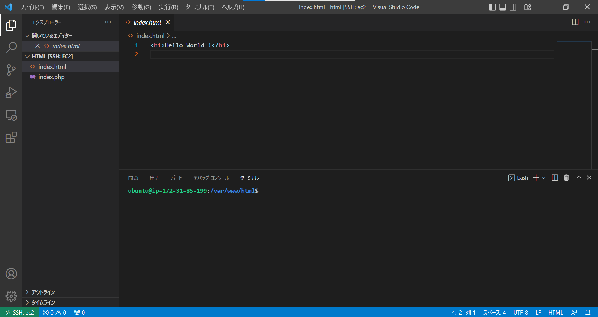
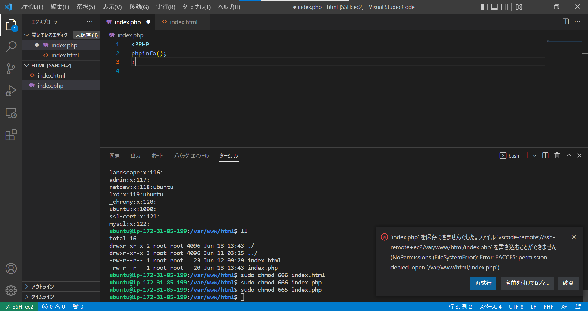

# vscode で開発

!!! note

    手元のパソコンにVisual Studio Codeをインストールする必要があります。
    インストールしていない方は以下の記事を参考にインストールしてください。
    「Visual Studio Codeインストール手順＜Windows向け＞」
    https://sukkiri.jp/technologies/devtools/vscode_win.html

## EC2 に接続



サイドバーの`田`をクリック
検索ボックスに`Remote`と入力する
`インストール`ボタンをクリック



サイドバーの`リモートエクスプローラー`をクリック
`SSHターゲット`の右にある`歯車`をクリック
`C:\Users\123456\.ssh\config`を選択

```config title="C:\Users\123456\ .ssh\config"
Host ec2
  Hostname 34.201.38.2
  User ubuntu
  Port 22
  IdentityFile C:\Users\123456\Documents\labsuser.pem
```

上記のように入力する。

- `Hostname`には、EC2 の IP アドレス
- `User`には、ubuntu を指定
- `Port`には、22 を指定
- `IdentityFile`を指定

!!! note

    SSH接続するための情報を記載するためのファイルである。
    `C:\Users\hoge\ .ssh\config`に設定することでSSHする際に参照される。



SSH ターゲットに`ec2`が表示される
`ec2`の右にあるアイコンの`+`をクリック



新しい vscode の画面が表示され、上記のような画面になる(接続完了までに時間がかかることがある)
`[フォルダーを開く]`をクリック
画面上部の入力エリアに`/var/www/html`と入力する



今まで書き込んできた`/var/www/html`の中のファイルが表示される。

---

これで、EC2 の中に存在するファイルを手元のパソコンから編集することができる。

## エラー



上の画像のようなエラーが出た場合は、[パーミッション](../security/permission.md)が原因です。
`chmod`コマンドを用いて権限を変更してください。

```sh
ubuntu@ip-172-31-85-199:/var/www/html$ sudo chmod 666 index.html
ubuntu@ip-172-31-85-199:/var/www/html$ sudo chmod 666 index.php
```

このように設定することで、`ubuntu`ユーザーが書き込みすることができます。

詳細は[こちら](../security/permission.md)を確認してください。

## 参考

[VSCode の Remote - SSH 機能を使って EC2 上で開発する](https://blog.serverworks.co.jp/tech/2020/02/20/vscode-remote-ssh/)
