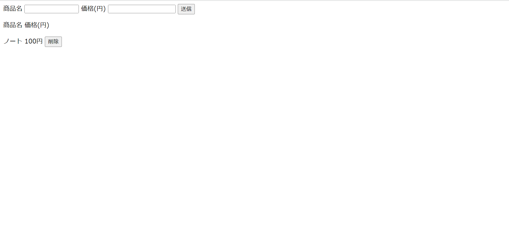

# データベースからデータを取得

## 必要なものをインストール

### `php-pdo`

```sh
ubuntu@ip-172-31-85-199:/var/www/html$ ____ ___ _______ _______
Reading package lists... Done
Building dependency tree... Done
Reading state information... Done
Note, selecting 'php8.1-common' instead of 'php-pdo'
php8.1-common is already the newest version (8.1.2-1ubuntu2.1).
php8.1-common set to manually installed.
0 upgraded, 0 newly installed, 0 to remove and 23 not upgraded.
```

#### 確認

```sh
ubuntu@ip-172-31-85-199:~$ apt search php-db
Sorting... Done
Full Text Search... Done
php-db/jammy 1.10.0-1build4 all
  Database Abstraction Layer
```

正常にインストールできているか、上記のコマンドで確認してください。

### `php-mysql`

```sh
ubuntu@ip-172-31-85-199:/var/www/html$ ____ ___ _______ _________
Do you want to continue? [Y/n] Y
Get:1 http://us-east-1.ec2.archive.ubuntu.com/ubuntu jammy-updates/main amd64 php8.1-mysql amd64 8.1.2-1ubuntu2.1 [130 kB]
Get:2 http://us-east-1.ec2.archive.ubuntu.com/ubuntu jammy/main amd64 php-mysql all 2:8.1+92ubuntu1 [1834 B]
Fetched 132 kB in 0s (2329 kB/s)
Selecting previously unselected package php8.1-mysql.
(Reading database ... 122785 files and directories currently installed.)
Preparing to unpack .../php8.1-mysql_8.1.2-1ubuntu2.1_amd64.deb ...
Unpacking php8.1-mysql (8.1.2-1ubuntu2.1) ...
Selecting previously unselected package php-mysql.
Preparing to unpack .../php-mysql_2%3a8.1+92ubuntu1_all.deb ...
Unpacking php-mysql (2:8.1+92ubuntu1) ...
Setting up php8.1-mysql (8.1.2-1ubuntu2.1) ...

Creating config file /etc/php/8.1/mods-available/mysqlnd.ini with new version

Creating config file /etc/php/8.1/mods-available/mysqli.ini with new version

Creating config file /etc/php/8.1/mods-available/pdo_mysql.ini with new version
Setting up php-mysql (2:8.1+92ubuntu1) ...
Processing triggers for libapache2-mod-php8.1 (8.1.2-1ubuntu2.1) ...
Processing triggers for php8.1-cli (8.1.2-1ubuntu2.1) ...
Scanning processes...
Scanning candidates...
Scanning linux images...

Restarting services...
 systemctl restart apache2.service


No containers need to be restarted.

No user sessions are running outdated binaries.

No VM guests are running outdated hypervisor (qemu) binaries on this host.
```

#### 確認

```sh
ubuntu@ip-172-31-85-199:~$ apt search php-mysql
Sorting... Done
Full Text Search... Done
php-mysql/jammy,now 2:8.1+92ubuntu1 all [installed]
  MySQL module for PHP [default]

```

正常にインストールが完了しているか確認してください。

これで PHP からデータベース(MySQL)にアクセスできるようになりました。

!!! Question

    パッケージ管理について解説しています。
    [APT コマンドについて](../linux/packages.md)

### PHP のプログラム

PHP からデータベースにアクセスし、**データの作成**、**データの削除**、**データの取得**を行います。

!!! Question

    MySQLについて解説しています。
    [MySQLについて](../middleware/database.md)

!!! info

    データベース(RDB リレーショナルデータベース)で、**データの作成**、**データの削除**、**データの取得**、**データの更新**を行うことを、
    データの作成（Create）、読み出し（Read）、更新（Update）、削除（Delete）の頭文字をとって**CRUD**と言われている。

以下のコードを`/var/www/index.php`に上書きしてください。

```php
<?php

$dsn = 'mysql:dbname=webapp;host=localhost';
$user = 'webapp';
$password = 'webappのパスワード';

try {
    $dbh = new PDO($dsn, $user, $password);
} catch (PDOException $e) {
    print('Error:' . $e->getMessage());
    die();
}

// POST
if ($_POST['method'] == 'post') {
    // 穴埋め
    $stmt = $dbh->prepare("______ ____ product (name, price) VALUES (:name, :price)");
    $stmt->bindParam(':name', $_POST['name'], PDO::PARAM_STR);
    $stmt->bindParam(':price', $_POST['price'], PDO::PARAM_INT);
    $res = $stmt->execute();

    header('Location: index.php');
}

// DELETE
if ($_POST['method'] == 'delete') {
    // 穴埋め
    $stmt = $dbh->prepare("______ ____ product WHERE name = :name AND price=:price");
    $stmt->bindParam(':name', $_POST['name'], PDO::PARAM_STR);
    $stmt->bindParam(':price', $_POST['price'], PDO::PARAM_INT);
    $res = $stmt->execute();

    header('Location: index.php');
}


?>
<!DOCTYPE html>
<html lang="ja">

<head>
    <meta charset="UTF-8">
    <meta http-equiv="X-UA-Compatible" content="IE=edge">
    <meta name="viewport" content="width=device-width, initial-scale=1.0">
    <title>売店 | 管理画面</title>
</head>

<body>

    <form method="post" action="index.php">
        <input name="method" type="hidden" value="post">
        商品名
        <input type="text" name="name" size="15">
        価格(円)
        <input type="number" name="price">
        <input type="submit" value="送信">
    </form>

    <?php
    // GET
    $sql = 'select * from product';
    print('<p>商品名  価格(円)</p>');
    foreach ($dbh->query($sql) as $row) {
    ?>
        <form method="post" action="index.php">
            <?php print($row['name'] . ' ' . $row['price'] . '円   '); ?>
            <input name="method" type="hidden" value="delete">
            <input name="name" type="hidden" value="<?php print($row['name']); ?>">
            <input name="price" type="hidden" value="<?php print($row['price']); ?>">
            <input type="submit" value="削除">
        </form>
    <?php
    }
    ?>

</body>

</html>
```

## 画面を確認

以下のような画面になると思います。



送信ボタン、削除ボタンが正常に動作するか確認してください。

!!! warning

    エラーが出た場合は、[ログ](../appendix/apach-log.md)を見てください。

これで、Apache、MySQL、PHP の設定が完了しました。

## 確認

すべての穴埋めを行い、コマンドの実行が完了したら、以下のコマンドを実行してください。

```sh
$ grech check chapter "end"
```

### 以上でチュートリアルは終了です。

[このコードの解説はこちらです](./php-tutorial.md)

---

## 付録

PHP 以外にも Python や Perl での解説もあります。

### Python , Perl (CGI)

データベースに接続までは解説しませんが、Python, Perl(CGI)での解説もあります。

[Python(CGI)](../appendix/python.md)
[Perl(CGI)](../appendix/perl.md)
