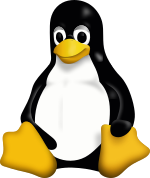

# 概要

{ align=right }

## Linux とは

Linux は Unix 系のオペレーティングシステムの 1 つである。Linux は、サーバー、家電製品で多く用いられている。Linux の開発は、フリーかつオープンソースなソフトウェアである。デスクトップやサーバ用の Linux は、Linux ディストリビューションという形でパッケージ化されて配布されている。有名な Linux ディストリビューションは、Debian（とその派生である Ubuntu）、Red Hat Linux、Arch Linux などがある。

!!! Info

    大学のコンピュータ教室の PC には CentOS(フリーのLinuxディストリビューション)がインストールされています。

## Windows とは

Microsoft Windows は、マイクロソフトが開発・販売するオペレーティングシステムである。グラフィカルユーザインタフェース (GUI) を採用している。Microsoft Windows は、コマンド入力が中心でシングルタスクでしか動作しない MS-DOS(CUI)の代替として開発された。

## windows と Linux の違い

Linux はオープンソースであり、無償で利用できるディストリビューションが多い。Microsoft Windows は、ソースコードは公開されておらず、有償である。

また、Linux は **CUI** での操作がしやすいのに対して、Microsoft Windows は **GUI** の操作がしやすいことが特徴である。

## 参考

詳細はこちらを参照してください。

[Linux ディストリビューション](https://exercises-aws.fml.org/ja/appendix/unix/linux/distro/)

---

[Linux](https://ja.wikipedia.org/wiki/Linux)
