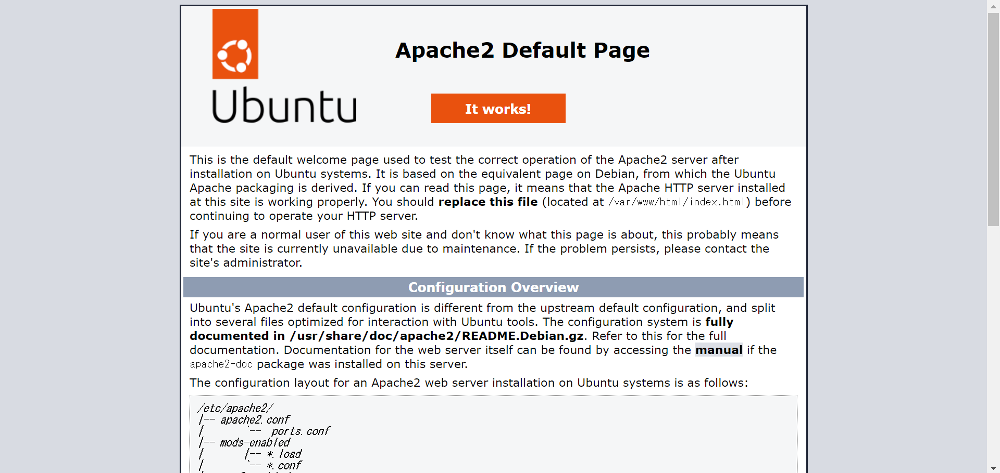
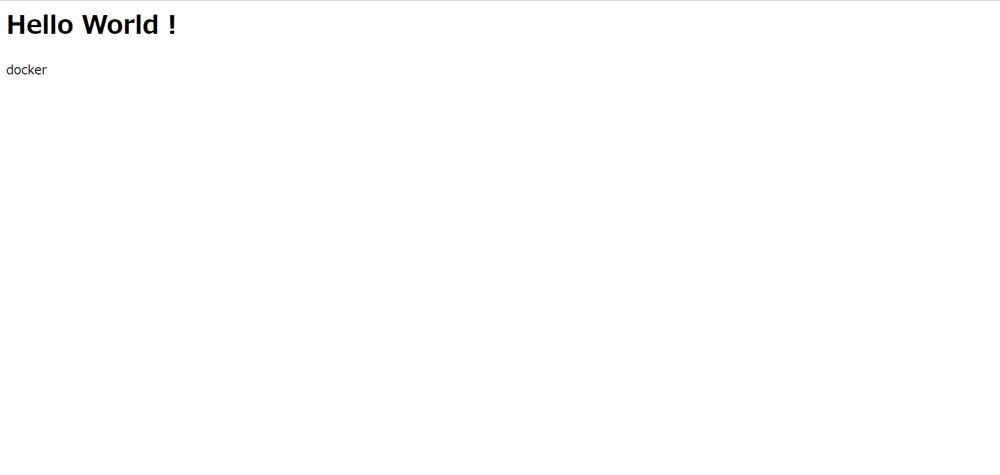

# docker とは

## docker をインストール

!!! note

      「Docker ドキュメント日本語化プロジェクト」通りでインストールします。
      https://docs.docker.jp/linux/step_one.html

`curl`コマンドを用いてインストールします。

!!! note

      cURLとは、URLで示されるネットワーク上の場所との間でデータの送受信を行うコマンドである。

---

`curl`で取得した`shell(シェル)`を`|`で`sh`に渡して実行する。

```sh
ubuntu@ip-172-31-85-199:/var/www/html$ curl -fsSL https://get.docker.com/ | sh
# Executing docker install script, commit: b2e29ef7a9a89840d2333637f7d1900a83e7153f
Warning: the "docker" command appears to already exist on this system.

If you already have Docker installed, this script can cause trouble, which is
why we're displaying this warning and provide the opportunity to cancel the
installation.

If you installed the current Docker package using this script and are using it
again to update Docker, you can safely ignore this message.

You may press Ctrl+C now to abort this script.
+ sleep 20
+ sudo -E sh -c apt-get update -qq >/dev/null
+ sudo -E sh -c DEBIAN_FRONTEND=noninteractive apt-get install -y -qq apt-transport-https ca-certificates curl
>/dev/null
+ sudo -E sh -c mkdir -p /etc/apt/keyrings && chmod -R 0755 /etc/apt/keyrings
+ sudo -E sh -c curl -fsSL "https://download.docker.com/linux/ubuntu/gpg" | gpg --dearmor --yes -o /etc/apt/keyrings/docker.gpg
+ sudo -E sh -c chmod a+r /etc/apt/keyrings/docker.gpg
+ sudo -E sh -c echo "deb [arch=amd64 signed-by=/etc/apt/keyrings/docker.gpg] https://download.docker.com/linux/ubuntu jammy stable" > /etc/apt/sources.list.d/docker.list
+ sudo -E sh -c apt-get update -qq >/dev/null
+ sudo -E sh -c DEBIAN_FRONTEND=noninteractive apt-get install -y -qq --no-install-recommends docker-ce docker-ce-cli containerd.io docker-compose-plugin docker-scan-plugin >/dev/null
+ version_gte 20.10
+ [ -z  ]
+ return 0
+ sudo -E sh -c DEBIAN_FRONTEND=noninteractive apt-get install -y -qq docker-ce-rootless-extras >/dev/null
+ sudo -E sh -c docker version
Client: Docker Engine - Community
 Version:           20.10.17
 API version:       1.41
 Go version:        go1.17.11
 Git commit:        100c701
 Built:             Mon Jun  6 23:02:46 2022
 OS/Arch:           linux/amd64
 Context:           default
 Experimental:      true

Server: Docker Engine - Community
 Engine:
  Version:          20.10.17
  API version:      1.41 (minimum version 1.12)
  Go version:       go1.17.11
  Git commit:       a89b842
  Built:            Mon Jun  6 23:00:51 2022
  OS/Arch:          linux/amd64
  Experimental:     false
 containerd:
  Version:          1.6.6
  GitCommit:        10c12954828e7c7c9b6e0ea9b0c02b01407d3ae1
 runc:
  Version:          1.1.2
  GitCommit:        v1.1.2-0-ga916309
 docker-init:
  Version:          0.19.0
  GitCommit:        de40ad0

================================================================================

To run Docker as a non-privileged user, consider setting up the
Docker daemon in rootless mode for your user:

    dockerd-rootless-setuptool.sh install

Visit https://docs.docker.com/go/rootless/ to learn about rootless mode.


To run the Docker daemon as a fully privileged service, but granting non-root
users access, refer to https://docs.docker.com/go/daemon-access/

WARNING: Access to the remote API on a privileged Docker daemon is equivalent
         to root access on the host. Refer to the 'Docker daemon attack surface'
         documentation for details: https://docs.docker.com/go/attack-surface/

================================================================================

ubuntu@ip-172-31-85-199:/var/www/html$
```

Docker 公式の GPG 公開鍵をインストールする。

```sh
ubuntu@ip-172-31-85-199:/var/www/html$ curl -fsSL https://get.docker.com/gpg | sudo apt-key add -
Warning: apt-key is deprecated. Manage keyring files in trusted.gpg.d instead (see apt-key(8)).
OK
```

##　動作確認

docker のインストールが正常かどうかを確認する。
(Hello World を行います。)

```sh
ubuntu@ip-172-31-85-199:/var/www/html$ sudo docker run hello-world
Unable to find image 'hello-world:latest' locally
latest: Pulling from library/hello-world
2db29710123e: Pull complete
Digest: sha256:13e367d31ae85359f42d637adf6da428f76d75dc9afeb3c21faea0d976f5c651
Status: Downloaded newer image for hello-world:latest

Hello from Docker!
This message shows that your installation appears to be working correctly.

To generate this message, Docker took the following steps:
 1. The Docker client contacted the Docker daemon.
 2. The Docker daemon pulled the "hello-world" image from the Docker Hub.
    (amd64)
 3. The Docker daemon created a new container from that image which runs the
    executable that produces the output you are currently reading.
 4. The Docker daemon streamed that output to the Docker client, which sent it
    to your terminal.

To try something more ambitious, you can run an Ubuntu container with:
 $ docker run -it ubuntu bash

Share images, automate workflows, and more with a free Docker ID:
 https://hub.docker.com/

For more examples and ideas, visit:
 https://docs.docker.com/get-started/

```

上記のようになれば Docker が動作しています。

## docker で Apach を起動

!!! note

      「ubuntu/apache2」のDockerイメージを用いてApachを起動します。
      https://hub.docker.com/r/ubuntu/apache2

Docker hub のページの**Usage**のコマンドそのままです。

```sh
ubuntu@ip-172-31-85-199:/var/www/html$ sudo docker run -d --name apache2-container -e TZ=UTC -p 80:80 ubuntu/apache2:2.4-22.04_beta
Unable to find image 'ubuntu/apache2:2.4-22.04_beta' locally
2.4-22.04_beta: Pulling from ubuntu/apache2
e4781cb1bb49: Pull complete
4d7aaa396fc2: Pull complete
b0b327d101f4: Pull complete
Digest: sha256:0e51d4dcc4ceac6d138404e342756c138311063313a7f196a985c22d43217c8b
Status: Downloaded newer image for ubuntu/apache2:2.4-22.04_beta
ed3d84c36c5ed599338dde2540db8329b721e40ee2a03bdb2c95ac6975cfa61e
```

`docker run -d --name apache2-container -e TZ=UTC -p 80:80 ubuntu/apache2:2.4-22.04_beta`

のコマンドを解説します。

1. `docker`: `docker`コマンドである
2. `run`: イメージをもとにコンテナを起動する
3. `--name apache2-container`: コンテナに名前を指定する(今回は`apache2-container`という名前)
4. `-e TZ=UTC`: 環境変数を設定(`TZ`(タイムゾーン)を`UTC`に設定)
5. `-p 80:80`: ポートについての設定(`:`の前の`80`はホスト OS 側のポート、`:`の後の`80`はコンテナ内のポート)
6. `ubuntu/apache2:2.4-22.04_beta`: Docker イメージを指定(今回は Docker hub で公開されているイメージを指定)



## Docker コンテナを確認

```sh
ubuntu@ip-172-31-85-199:/var/www/html$ sudo docker ps
CONTAINER ID   IMAGE                           COMMAND                CREATED              STATUS
PORTS                               NAMES
c26c80a7ef70   ubuntu/apache2:2.4-22.04_beta   "apache2-foreground"   About a minute ago   Up About a minute
0.0.0.0:80->80/tcp, :::80->80/tcp   apache2-container
```

起動しているコンテナを確認する。

## コンテナを停止

```sh
ubuntu@ip-172-31-85-199:/var/www/html$ sudo docker container stop 5101aed26dfd
5101aed26dfd
```

`docker ps`で確認したコンテナの`CONTAINER ID`を指定してコンテナを停止。

## コンテナを削除

```sh
ubuntu@ip-172-31-85-199:/var/www/html$ sudo docker container rm 5101aed26dfd
5101aed26dfd
```

`docker ps`で確認したコンテナの`CONTAINER ID`を指定してコンテナを削除。

## 自分のソースコード(HTML)を表示させる

```sh
ubuntu@ip-172-31-85-199:/var/www/html$ sudo docker run -d --name apache2-container -e TZ=UTC -p 80:80 -v "$PWD":/var/www/html/ ubuntu/apache2:2.4-22.04_beta
c26c80a7ef70cc1cc1516c38a32283caff3b085872b58cba66ea9cdf29a1f292
```

`/var/www/html`で上記のコマンドを実行する。

重要なのは、`-v "$PWD":/var/www/html/`です。
`-v`はディレクトリの中のコードを共有するオプションです。今回は、`"$PWD":/var/www/html/`であり、`"$PWD"`(ホスト OS のソースコード)を`/var/www/html/`(コンテナ内のソースコード)に置き換えさせる。つまり、コンテナ内の`/var/www/html/`に、あなたが書いた`index.html`と`index.php`に置き換えられる。

```sh
ubuntu@ip-172-31-85-199:/var/www/html$ cat index.html
<h1>Hello World !</h1>
<p>docker</p>
```

コンテナを起動中に、`index.html`を変更してみましょう。上記のように編集してみてください。



## image

```sh
ubuntu@ip-172-31-85-199:/var/www/html$ sudo docker images
REPOSITORY       TAG              IMAGE ID       CREATED        SIZE
ubuntu/apache2   2.4-22.04_beta   7a3c9c370072   5 days ago     181MB
hello-world      latest           feb5d9fea6a5   8 months ago   13.3kB
ubuntu@ip-172-31-85-199:/var/www/html$ sudo docker image rm feb5d9fea6a5
Untagged: hello-world:latest
Untagged: hello-world@sha256:13e367d31ae85359f42d637adf6da428f76d75dc9afeb3c21faea0d976f5c651
Deleted: sha256:feb5d9fea6a5e9606aa995e879d862b825965ba48de054caab5ef356dc6b3412
Deleted: sha256:e07ee1baac5fae6a26f30cabfe54a36d3402f96afda318fe0a96cec4ca393359
```

## エラー

sudo つけ忘れ

```sh
ubuntu@ip-172-31-85-199:/var/www/html$ docker container stop c26c80a7ef70
Got permission denied while trying to connect to the Docker daemon socket at unix:///var/run/docker.sock: Post
"http://%2Fvar%2Frun%2Fdocker.sock/v1.24/containers/c26c80a7ef70/stop": dial unix /var/run/docker.sock: connect: permission denied
```

ポート被り

```sh
ubuntu@ip-172-31-85-199:/var/www/html$ sudo docker run -d --name apache2-container2 -e TZ=UTC -p 80:80 -v "$PWD":/var/www/html/ ubuntu/apache2:2.4-22.04_beta
d188d468786a0d69d6db3ed73172c21341dcff1da28b8cf22f39fa411ae9321e
docker: Error response from daemon: driver failed programming external connectivity on endpoint apache2-container2 (04e52919727a2438fd6495394991ecffb16bb7c837ac987d5bb10b8a00ab4c6d): Bind for 0.0.0.0:80 failed: port is already allocated.
```

コンテナ名の重複

```sh
ubuntu@ip-172-31-85-199:/var/www/html$ sudo docker run -d --name apache2-container2 -e TZ=UTC -p 80:80 -v "$PWD":/var/www/html/ ubuntu/apache2:2.4-22.04_beta
docker: Error response from daemon: Conflict. The container name "/apache2-container2" is already in use by container "5b35aea1656e7990eaf87726969da5029b9c058a96867cf26546683b82491763". You have to remove (or rename) that
container to be able to reuse that name.
See 'docker run --help'.
```

## 参考

[Docker のインストール](https://docs.docker.jp/linux/step_one.html)

[よく使う curl コマンドのオプション](https://qiita.com/ryuichi1208/items/e4e1b27ff7d54a66dcd9)
