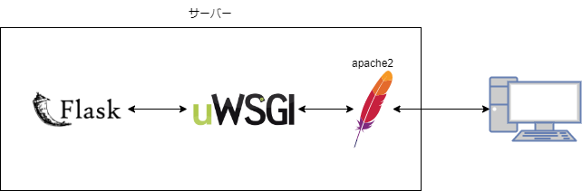

## flask とは

Python の Web アプリケーションフレームワークであり、小規模なフレームワークです。

### flask をインストール

`pip`コマンドを用いてインストールします。
ディレクトリはどこで実行しても問題ないです。

```sh
ubuntu@ip-172-31-85-199:/var/www/html$ sudo pip install flask
Collecting flask
  Downloading Flask-2.1.3-py3-none-any.whl (95 kB)
     ━━━━━━━━━━━━━━━━━━━━━━━━━━━━━━━━━━━━━━━━ 95.6/95.6 KB 3.9 MB/s eta 0:00:00
Collecting itsdangerous>=2.0
  Downloading itsdangerous-2.1.2-py3-none-any.whl (15 kB)
Requirement already satisfied: Jinja2>=3.0 in /usr/lib/python3/dist-packages (from flask) (3.0.3)
Collecting Werkzeug>=2.0
  Downloading Werkzeug-2.1.2-py3-none-any.whl (224 kB)
     ━━━━━━━━━━━━━━━━━━━━━━━━━━━━━━━━━━━━━━━━ 224.9/224.9 KB 13.7 MB/s eta 0:00:00
Requirement already satisfied: click>=8.0 in /usr/lib/python3/dist-packages (from flask) (8.0.3)
Installing collected packages: Werkzeug, itsdangerous, flask
Successfully installed Werkzeug-2.1.2 flask-2.1.3 itsdangerous-2.1.2
WARNING: Running pip as the 'root' user can result in broken permissions and conflicting behaviour with the system package manager. It is recommended to use a virtual environment instead: https://pip.pypa.io/warnings/venv
```

## uWSGI とは

アプリケーションサーバである。



flask は uWSGI と通信し、uWSGI は Apache2 と通信している。

!!! note

        uWSGIは簡易的なwebサーバであるため、アプリケーション公開時はApacheやnginxなどのwebサーバを用いて公開する。
        uWSGIはPythonのアプリケーションとApacheなどのwebサーバをつなぐ目的で作られて通信の規格です。
        PEP 333 – Python Web Server Gateway Interface v1.0
        https://peps.python.org/pep-0333/

### uWSGI をインストール

`pip`コマンドを用いてインストールします。
ディレクトリはどこで実行しても問題ないです。

```sh
ubuntu@ip-172-31-85-199:/var/www/html$ sudo pip install uwsgi
Collecting uwsgi
  Downloading uwsgi-2.0.20.tar.gz (804 kB)
     ━━━━━━━━━━━━━━━━━━━━━━━━━━━━━━━━━━━━━━━━ 804.9/804.9 KB 15.8 MB/s eta 0:00:00
  Preparing metadata (setup.py) ... done
Building wheels for collected packages: uwsgi
  Building wheel for uwsgi (setup.py) ... done
  Created wheel for uwsgi: filename=uWSGI-2.0.20-cp310-cp310-linux_x86_64.whl size=520835 sha256=7b36575326ec84242754aa7ec75b2da7417220d02c6a1500dfa79a93aea19569
  Stored in directory: /root/.cache/pip/wheels/06/05/96/5ee3e21875a5cab911fdbb7d8100b24fbd639c55a65b5b6ccb
Successfully built uwsgi
Installing collected packages: uwsgi
Successfully installed uwsgi-2.0.20
WARNING: Running pip as the 'root' user can result in broken permissions and conflicting behaviour with the system package manager. It is recommended to use a virtual environment instead: https://pip.pypa.io/warnings/venv
```

## libapache2-mod-wsgi-py3 をインストール

Apache と uWSGI で通信を行うために必要なものをインストールします。

```sh
ubuntu@ip-172-31-85-199:/var/www/html$ sudo apt install libapache2-mod-wsgi-py3
Reading package lists... Done
Building dependency tree... Done
Reading state information... Done
The following NEW packages will be installed:
  libapache2-mod-wsgi-py3
0 upgraded, 1 newly installed, 0 to remove and 25 not upgraded.
Need to get 106 kB of archives.
After this operation, 304 kB of additional disk space will be used.
Get:1 http://us-east-1.ec2.archive.ubuntu.com/ubuntu jammy/main amd64 libapache2-mod-wsgi-py3 amd64 4.9.0-1build1 [106 kB]
Fetched 106 kB in 0s (3209 kB/s)
Selecting previously unselected package libapache2-mod-wsgi-py3.
(Reading database ... 129569 files and directories currently installed.)
Preparing to unpack .../libapache2-mod-wsgi-py3_4.9.0-1build1_amd64.deb ...
Unpacking libapache2-mod-wsgi-py3 (4.9.0-1build1) ...
Setting up libapache2-mod-wsgi-py3 (4.9.0-1build1) ...
apache2_invoke: Enable module wsgi
Scanning processes...
Scanning linux images...

Running kernel seems to be up-to-date.

No services need to be restarted.

No containers need to be restarted.

No user sessions are running outdated binaries.

No VM guests are running outdated hypervisor (qemu) binaries on this host.
```

## 設定ファイルを編集

### uWSGI の設定

以下のように設定ファイルを記載してください。

!!! note

        今回は`/var/www/html/flask-app`というディレクトリを作成しましょう。
        このディレクトリに`uwsgi.ini`と`main.py`を作成しましょう。

```uwsgi.ini
[uwsgi]
socket = 127.0.0.1:8930
module = main
callable = app
master = True
chdir = /var/www/html/flask-app/
```

1. `socket`は起動するポートを指定
2. `module`は Python のファイル名
3. `callable`は`app = Flask(__name__)`の`app`に合わせる
4. `master`モードで起動
5. `chdir`は Python のソースコードがあるディレクトリを指定

### Apache の設定

Apache が uWSGI を認識するように設定を加えます。

`/etc/apache2/sites-enabled/`の中に`flask.conf`を作成し、以下のように入力してください。

!!! note

        `sites-enabled`にファイルを置くことで設定を追加することができます。

```conf title="/etc/apache2/sites-enabled/flask.conf"
LoadModule proxy_module /usr/lib/apache2/modules/mod_proxy.so
LoadModule proxy_uwsgi_module /usr/lib/apache2/modules/mod_proxy_uwsgi.so

ProxyPass /flask/ uwsgi://127.0.0.1:8930/
ProxyPassReverse /flask/ uwsgi://127.0.0.1:8930/
```

!!! note

        `ProxyPass /flask/ uwsgi://127.0.0.1:8930/`
        `/flask/`とすることで起動時に`http://{ip address}/flask/`でflaskのアプリケーションを公開することができます。

## Python のコード

`Hello World!`というメッセージを返すアプリケーションです。

!!! note

        `/var/www/html/flask-app`ディレクトリに作成しましょう。

```py title="main.py"
from flask import Flask, jsonify, request
app = Flask(__name__)

@app.route('/')
def hello():
    text = "Hello World!"
    return jsonify(message = text)

if __name__ == '__main__':
    app.run()
```

## 起動

### uWSGI

`/var/www/html/flask-app`ディレクトリに移動してから以下のコマンドを実行して、uWSGI を起動します。

!!! note

        コマンドの末尾の`&`はバックグラウンドで起動するという意味です。
        実行後は`Ctrl+c`で抜けましょう。(uWSGIは起動しています)

```sh
ubuntu@ip-172-31-85-199:/var/www/html/flask-app$ uwsgi --ini uwsgi.ini &
[uWSGI] getting INI configuration from uwsgi.ini
*** Starting uWSGI 2.0.20 (64bit) on [Tue Jul 19 13:02:52 2022] ***
compiled with version: 11.2.0 on 18 July 2022 13:32:36
os: Linux-5.15.0-1015-aws #19-Ubuntu SMP Wed Jun 22 17:44:56 UTC 2022
nodename: ip-172-31-85-199
machine: x86_64
clock source: unix
detected number of CPU cores: 1
current working directory: /var/www/html/flask-app
detected binary path: /usr/local/bin/uwsgi
!!! no internal routing support, rebuild with pcre support !!!
chdir() to /var/www/html/flask-app/
your processes number limit is 3819
your memory page size is 4096 bytes
detected max file descriptor number: 1024
lock engine: pthread robust mutexes
thunder lock: disabled (you can enable it with --thunder-lock)
uwsgi socket 0 bound to TCP address 127.0.0.1:8930 fd 3
Python version: 3.10.4 (main, Jun 29 2022, 12:14:53) [GCC 11.2.0]
*** Python threads support is disabled. You can enable it with --enable-threads ***
Python main interpreter initialized at 0x55f6bce07130
your server socket listen backlog is limited to 100 connections
your mercy for graceful operations on workers is 60 seconds
mapped 145808 bytes (142 KB) for 1 cores
*** Operational MODE: single process ***
WSGI app 0 (mountpoint='') ready in 0 seconds on interpreter 0x55f6bce07130 pid: 1450 (default app)
*** uWSGI is running in multiple interpreter mode ***
spawned uWSGI master process (pid: 1450)
spawned uWSGI worker 1 (pid: 1451, cores: 1)
[pid: 1451|app: 0|req: 1/1] 106.184.155.206 () {56 vars in 1146 bytes} [Tue Jul 19 13:03:02 2022] GET /flask/ => generated 27 bytes in 2 msecs (HTTP/1.1 200) 2 headers in 71 bytes (1 switches on core 0)
```

> ```sh
> ubuntu@ip-172-31-85-199:/var/www/html/flask-app$ killall -9 uwsgi
> Tue Jul 19 13:20:50 2022 - uWSGI worker 1 screams: UAAAAAAH my master disconnected: i will kill myself !!!
> [1]+ Killed uwsgi --ini uwsgi.ini
> ```
>
> uWSGI を停止させたい場合はプロセスを停止させてください。

### Apache

Apache の設定も再読み込みさせましょう。

```sh
ubuntu@ip-172-31-85-199:/var/www/html/flask-app$ sudo systemctl reload apache2
```

## 確認

!!! note

    **SSH**接続した際に使った**IP アドレス**をブラウザに入力する。
    `http://{ip address}/flask/`にアクセスする。

ブラウザに以下のような JSON が表示されていれば成功です。

```json
{ "message": "Hello World!" }
```

---

## データベース(MySQL)に接続

今回は PyMySQL というライブラリを用いて Python から MySQL に接続しデータを取得します。

!!! note

        Pythonからデータベースにデータの挿入や削除は行いません。

```sh
ubuntu@ip-172-31-85-199:/var/www/html/flask-app$ pip install -U PyMySQL
Defaulting to user installation because normal site-packages is not writeable
Collecting PyMySQL
  Downloading PyMySQL-1.0.2-py3-none-any.whl (43 kB)
     ━━━━━━━━━━━━━━━━━━━━━━━━━━━━━━━━━━━━━━━━ 43.8/43.8 KB 2.4 MB/s eta 0:00:00
Installing collected packages: PyMySQL
Successfully installed PyMySQL-1.0.2
```

Python のコードは以下のように修正します。

データベースからデータを受け取り、データベースの内容を表示しています。

```py title="main.py"
from flask import Flask, jsonify, request
import json

import pymysql.cursors

app = Flask(__name__)

@app.route('/')
def hello():
    # データベースに接続
    connection = pymysql.connect(host='localhost',user='webapp',password='qazWSX123$',database='webapp',cursorclass=pymysql.cursors.DictCursor)
    cursor = connection.cursor()
    # データ読み込み
    sql = "select * from product"
    cursor.execute(sql)
    result = cursor.fetchall()
    # 日本語の文字化け対策
    enc = json.dumps(result, ensure_ascii=False)
    cursor.close()
    return enc

if __name__ == '__main__':
    app.run()
```

uWSGI を再起動して動かしましょう。

```sh
ubuntu@ip-172-31-85-199:/var/www/html/flask-app$ uwsgi --ini uwsgi.ini
```

## 確認

!!! note

    **SSH**接続した際に使った**IP アドレス**をブラウザに入力する。
    `http://{ip address}/`にアクセスする。

PHP のアプリケーションで`ペン`,`100`と入力する。


!!! note

    **SSH**接続した際に使った**IP アドレス**をブラウザに入力する。
    `http://{ip address}/flask/`にアクセスする。

flask のアプリケーションで PHP で入力した、`ペン`,`100`が以下のように出力されていれば成功です。


PHP で変更したデータが flask のアプリケーションでも取得できることが確認できました。
