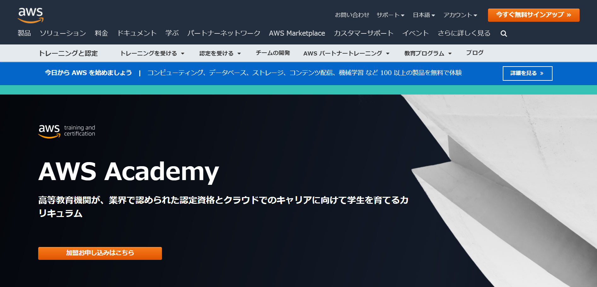

# AWS academy とは

<figure markdown>

<figcaption>https://aws.amazon.com/jp/training/awsacademy/</figcaption>
</figure>

> AWS Academy は、学生たちが将来、業界で認知されている認定の取得や、需要の高いクラウド関連の仕事に就くための支援を目的に、パッケージ化されたクラウドコンピューティング学習カリキュラムを高等教育機関向けに無償で提供しています。このカリキュラムでは、AWS クラウドによる革新の最前線にいる教師をサポートすることで、学生たちが成長著しい業界で活躍するために求められるスキルを身に付けられるようにします。
> https://aws.amazon.com/jp/training/awsacademy/

AWS は次のページで解説します

!!! Warning

    AWS academyでは、様々な制限があります。そのため、多くのサービスを利用することができません。また、マシンスペックにも制限があります。
    https://lectures.fml.org/slides/service/aws/academy/#2
