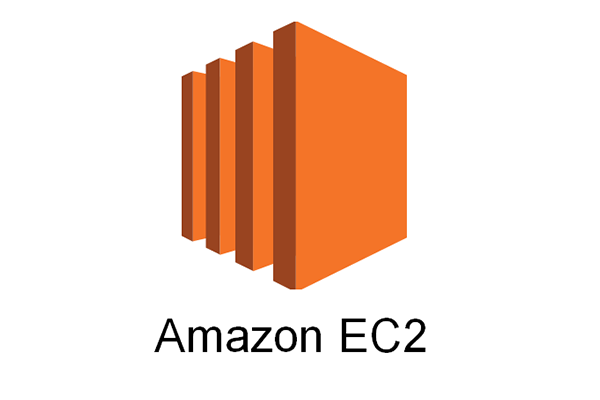

# Amazon EC2 とは

{ align=right width="300" }

> - インスタンスと呼ばれる仮想コンピューティング環境
> - インスタンスタイプと呼ばれる、インスタンス用の CPU、メモリ、ストレージ、ネットワーキングキャパシティーのさまざまな構成
> - キーペアを使用したインスタンス用の安全なログイン情報 (AWS はパブリックキーを保存し、ユーザーはプライベートキーを安全な場所に保存します)。
> - セキュリティグループを使用してインスタンスに到達可能で、プロトコル、ポート、ソース IP 範囲を指定できるファイアウォール
> - Elastic IP アドレスと呼ばれる、動的クラウドコンピューティング用の静的な IPv4 アドレス
>
> 「Amazon EC2 の機能」(一部抜粋)
> https://docs.aws.amazon.com/ja_jp/AWSEC2/latest/UserGuide/concepts.html

上記のような機能を有しています。ユーザーはこの仮想コンピュータにアプリケーションを構築し運用します。

## 機能の詳細

> - インスタンスと呼ばれる仮想コンピューティング環境

EC2 はコンピュータなので、CLI で指示をだし、操作することが可能です。

[CLI とは](../linux/cli-gui.md)

> - インスタンスタイプと呼ばれる、インスタンス用の CPU、メモリ、ストレージ、ネットワーキングキャパシティーのさまざまな構成

インスタンス(EC2 の単位)を作成する際に、設定次第で、アプリケーションにあった仮想コンピュータを作成することが可能です。

[OS について](../linux/index.md)

> - キーペアを使用したインスタンス用の安全なログイン情報 (AWS はパブリックキーを保存し、ユーザーはプライベートキーを安全な場所に保存します)。

SSH のキーペアをインスタンスを作成した時点で作成され、簡単に EC2 に SSH でアクセスし、操作することが可能です。

[SSH とは](../security/ssh.md)

> - セキュリティグループを使用してインスタンスに到達可能で、プロトコル、ポート、ソース IP 範囲を指定できるファイアウォール

インスタンスは世界中に公開されており、**プロトコル、ポート、ソース IP 範囲**を適切に設定しなければ攻撃される恐れがあります。そのため、インスタンスごとに、**プロトコル、ポート、ソース IP 範囲**を細かく設定することが可能です。

[IP アドレスとは](../security/ip.md)
[ポートとは](../security/port.md)

> - Elastic IP アドレスと呼ばれる、動的クラウドコンピューティング用の静的な IPv4 アドレス

インスタンスには IP アドレスが割り当てられています。
