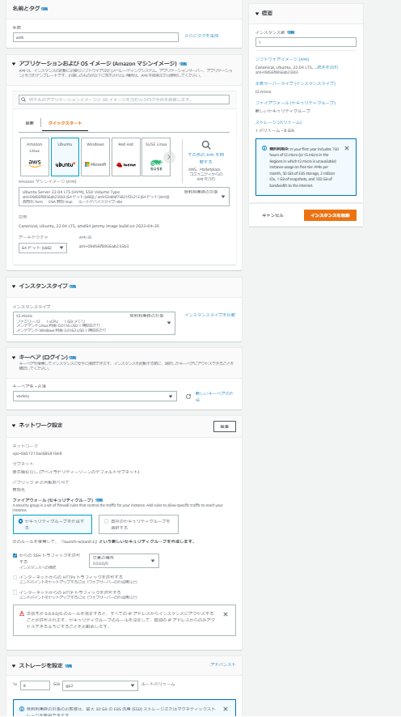
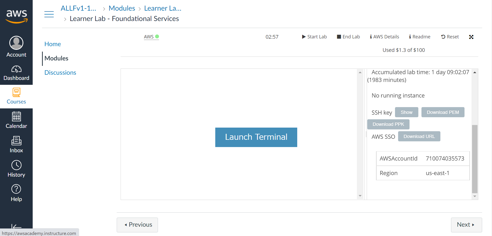
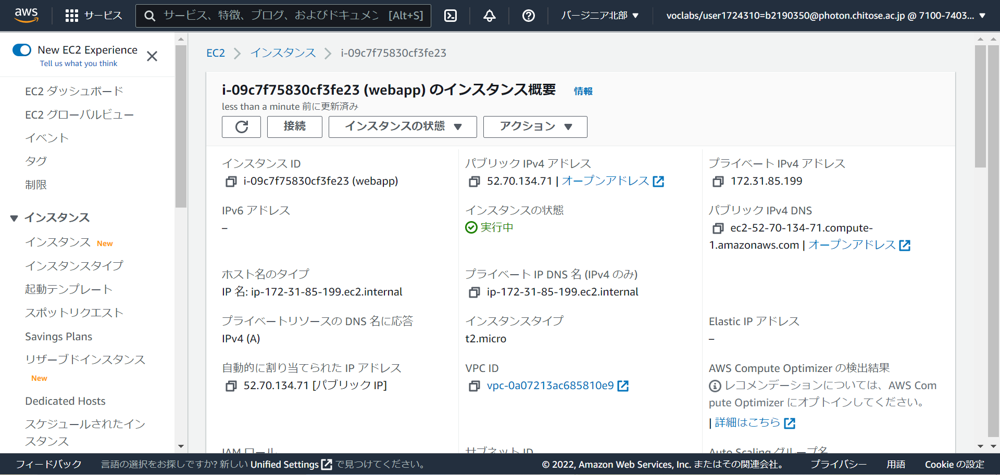
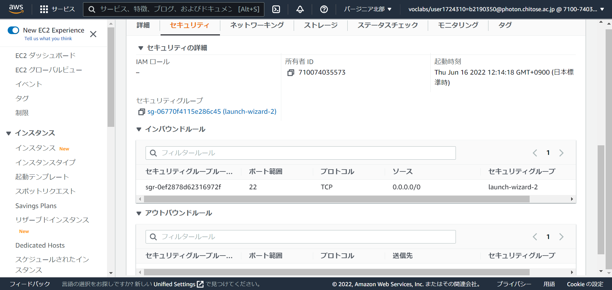
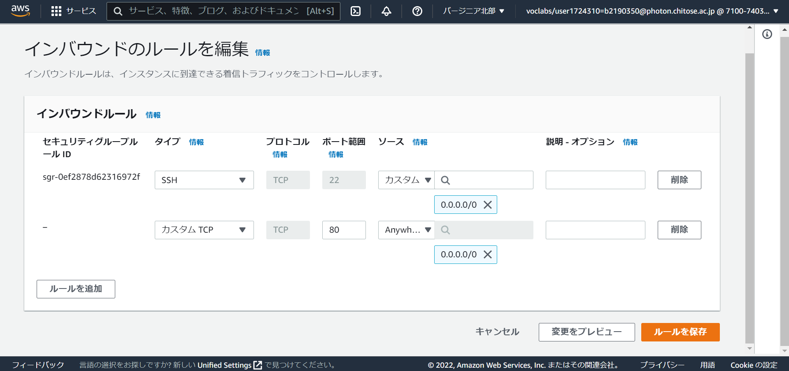
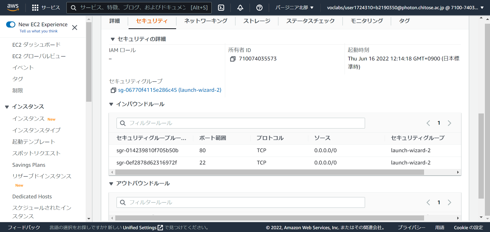

# EC2 インスタンスを作成

!!! note

    EC2について解説しています。
    [EC2について](../aws/ec2.md)

EC2 インスタンス作成の画面です。以下のように設定してください。

{ width="1000" }

1. web
2. Ubuntu
3. vockey

のみ変更

## SSH 鍵を取得

ここから取得

1. aws diteils をクリック
2. Download pem をクリック

!!! note

    ダウンロードしたSSHの秘密鍵は絶対に公開しないようにしましょう。
    GitHubなどにPushしないようにしましょう。

!!! note

    SSHについて解説しています。
    [SSHとは(公開鍵・秘密鍵)](../security/ssh.md)

---

## EC2 のセキュリティの設定

### EC2 の情報画面

EC2 の IP アドレスなどの情報が記載されています。この後解説する SSH で接続する際に、この IP アドレスを用いてアクセスします。
そのため、この画面はよく見る画面です。

!!! note

    IPアドレスについて解説しています。
    [IPアドレス](../security/ip.md)

### デフォルトのポートの許可

上の画像の画面を下にスクロールすると、このような画面になります。この画面で、EC2 に対して、アクセス許可されているプロトコルとポートが記載されています。

デフォルトでは、**22**番ポートの**TCP**が許可されています。ユーザーのコンピュータから SSH が接続が可能になっています。

!!! note

    ポートについて解説しています。
    [ポートとは](../security/port.md)

### ポートの許可

**TCP**の**80**番ポートを許可する設定を追加します。

`0.0.0.0/0`

このアドレスはすべてのアドレスを示しており。どのコンピュータからのアクセスを許可することを示しています。
そのため、**SSH**、**HTTP**の通信が世界中からのアクセスを許可されていることがわかります。

!!! note

    WEBサーバーでコンテンツを公開するので、**TCP**の**80**番ポートを許可する設定を追加します。
    ブラウザからIPアドレスを入力することで、EC2で起動されているWEBサーバーの画面が表示されます。

### 変更後

デフォルトの設定に加えて、**TCP**の**80**番ポートを許可する設定が追加されています。
