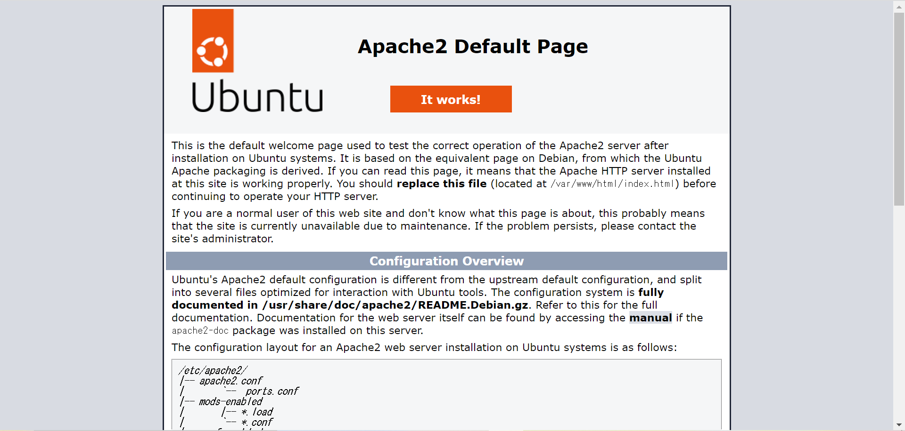

# HTML

## HTML 公開

### HTML を見る

!!! note

    **SSH**接続した際に使った**IP アドレス**をブラウザに入力する。

何もしてない場合の画面



この画面は HTML, CSS というもので表示されています。
この画面を構成する HTML を見てみます。この HTML は、`/var/www/html`の`index.html`です。

```sh
ubuntu@ip-172-31-85-199:~$ cd ../../var/www/html/
ubuntu@ip-172-31-85-199:/var/www/html$ cat index.html

...(省略)...
```

`cd`コマンドでディレクトリを移動しましょう。(ディレクトリを 2 つ上がります。そして、`var`ディレクトリに移動し、`var`、`html`ディレクトリに移動しています。)

`cat`コマンドで`index.html`の中身を表示しています。

> `cat`コマンドはファイルの中身を表示するコマンドである。

!!! note

    `ubuntu@ip-172-31-85-199:/var/www/html$ vi index.html`と打つことで`vi`(CLI エディタ)でファイルを編集することができます。

とても長い HTML が表示されていることが分かります。

### HTML を編集する

#### `index.html`ファイルの中身を削除しましょう。

```sh
ubuntu@ip-172-31-85-199:/var/www/html$ sudo rm -f index.html && sudo touch index.html
```

上記のコマンドでは、`sudo rm -f index.html`が成功した後に、`sudo touch index.html`を行っています。

> `sudo`とは superuser do の略である。`root`ユーザーで実行したいときにコマンドの前につける。
> SSH したときに指定したユーザー(Ubuntu)ではファイルを書き込む権限がないので`root`ユーザーになる必要がある。

!!! note

    ファイルの中身を消去する方法は多々ある。
    https://qiita.com/nabewata07/items/e67d008a1f10429bb3bf

#### `index.html`に書き込む

!!! note

    viを使わずに編集したい方はこちらの方法でも編集できます。ここでは、EC2に存在するファイルを手元のパソコンで編集する方法を紹介します。
    [vscode で開発(付録)](../appendix/remote-ssh.md)

```sh
ubuntu@ip-172-31-85-199:/var/www/html$ sudo vi index.html
```

`root`ユーザーで`index.html`を編集する。(`vi`を使う。(ほかのエディタを使ってもよい))

#### vi の使い方

黒い画面が出たら、

1. `i`と入力する(入力モードになる)
2. `↑→`キーでカーソルを移動
3. 自由に編集
4. `Esc`を押下
5. `:wq`と入力(変更を保存する)

#### 確認

`index.html`に`<h1>Hello World !</h1>`と入力すると、以下の画面になる。

!!! note

    **SSH**接続した際に使った**IP アドレス**をブラウザに入力する。


書き込んだ文字列が表示されていることが確認できる。

!!! note

    Apachではデフォルトで、URL(IPアドレス)でアクセスされた場合は、`index.php`または`index.html`を表示するように設定されている。
