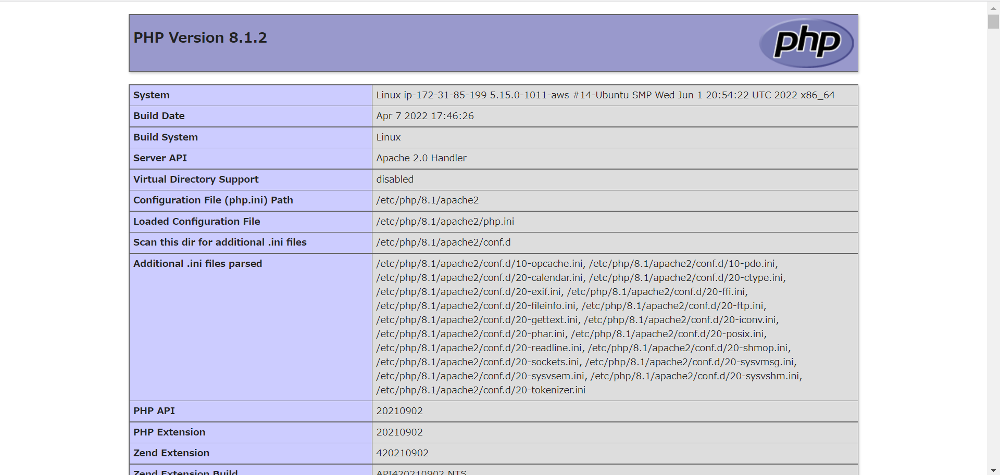

# PHP 公開

## PHP をインストール

```sh
ubuntu@ip-172-31-85-199:/var/www/html$ sudo apt install php
Reading package lists... Done
Building dependency tree... Done
Reading state information... Done
The following additional packages will be installed:
  libapache2-mod-php8.1 php-common php8.1 php8.1-cli php8.1-common php8.1-opcache php8.1-readline
Suggested packages:
  php-pear
The following NEW packages will be installed:
  libapache2-mod-php8.1 php php-common php8.1 php8.1-cli php8.1-common php8.1-opcache php8.1-readline
0 upgraded, 8 newly installed, 0 to remove and 22 not upgraded.
Setting up libapache2-mod-php8.1 (8.1.2-1ubuntu2) ...

Creating config file /etc/php/8.1/apache2/php.ini with new version
Module mpm_event disabled.
Enabling module mpm_prefork.
apache2_switch_mpm Switch to prefork
apache2_invoke: Enable module php8.1
Setting up php8.1 (8.1.2-1ubuntu2) ...
Setting up php (2:8.1+92ubuntu1) ...
Processing triggers for man-db (2.10.2-1) ...
Processing triggers for php8.1-cli (8.1.2-1ubuntu2) ...
Processing triggers for libapache2-mod-php8.1 (8.1.2-1ubuntu2) ...
Scanning processes...
Scanning linux images...

Running kernel seems to be up-to-date.

No services need to be restarted.

No containers need to be restarted.

No user sessions are running outdated binaries.

No VM guests are running outdated hypervisor (qemu) binaries on this host.
```

`apt`コマンドを用いて PHP をインストールする。

!!! Question

    パッケージ管理について解説しています。
    [APT コマンドについて](../linux/packages.md)

!!! Question

    PHPについて解説しています。
    [PHPについて](../dynamic-content/php.md)

    動的コンテンツについて解説しています。
    [動的コンテンツについて](../dynamic-content/index.md)

```sh
ubuntu@ip-172-31-85-199:/var/www/html$ php --version
PHP 8.1.2 (cli) (built: Apr  7 2022 17:46:26) (NTS)
Copyright (c) The PHP Group
Zend Engine v4.1.2, Copyright (c) Zend Technologies
    with Zend OPcache v8.1.2, Copyright (c), by Zend Technologies
```

`--version`で PHP がインストールされていることが確認できます。

## PHP のファイルを作成

```sh
ubuntu@ip-172-31-85-199:~$ cd ../../var/www/html/
ubuntu@ip-172-31-85-199:/var/www/html$ sudo vi index.php
```

`/var/www/html`に`index.php`を作成してください。

```php title="index.php"
<?PHP
phpinfo();
?>
```

[vi の使い方](../ec2-tutorial/public-html.md)

`index.php`には上記のように書いてみましょう。

!!! info

    viを使わずに編集したい方はこちらの方法でも編集できます。ここでは、EC2に存在するファイルを手元のパソコンで編集する方法を紹介します。
    [vscode で開発(付録)](../appendix/remote-ssh.md)

!!! note

    `phpinfo();`はPHPからシステムに関する情報を取得する関数です。
    https://www.php.net/manual/ja/tutorial.firstpage.php

## 動作確認

!!! note

    **SSH**接続した際に使った**IP アドレス**をブラウザに入力する。

ip アドレスの後ろに`/index.php`を入力する。(http://{ip address}/index.php)

!!! Question

    IPアドレスについて解説しています。
    [IPアドレスとは](../security//ip.md)



上記のように表示されます。正しく PHP のプログラムが動作していることが確認できます。

!!! warning

    上の画像のような画面が出ない場合は、ログを確認しましょう。エラーの原因が分かるかもしれません。
    [ログを確認](../appendix/apach-log.md)

!!! warning

    もし正常に動作しない場合は、Apachを再起動してください。
    [apachの操作方法](./apach-start.md)

## `Hello World`

`/var/www/html`に`index.php`を編集してください。

```php title="index.php"
<?PHP
print("Hello World !");
?>
```

[vi の使い方](../ec2-tutorial/public-html.md)

`index.php`には上記のように書いてみましょう。

!!! note

    **SSH**接続した際に使った**IP アドレス**をブラウザに入力する。

ip アドレスの後ろに`/index.php`を入力する。(http://{ip address}/index.php)


上記のように表示されます。正しく PHP のプログラムが動作していることが確認できます。

!!! info

    viで書き換えるのが大変だと感じてくると思います。ここで、EC2に存在するファイルを手元のパソコンで編集する方法を紹介します。
    [vscode で開発(付録)](../appendix/remote-ssh.md)
